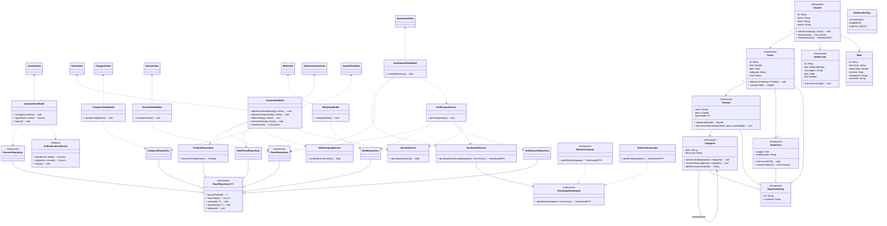

```mermaid
classDiagram
    direction TB

%% ===================== UI =====================
class UsuarioView
class GastoView
class DashboardView
class CategoriaView
class ExtratoView
class MetaView
class AdicionarGastoView
class GeminiTextView

class UsuarioViewModel {
    + carregarUsuarios(): void
    + login(email, senha): Usuario
    + logout(): void
}
class GastoViewModel {
    + adicionarGastoManual(g: Gasto): void
    + adicionarGastoCode(g: Gasto): void
    + editarGasto(g: Gasto): void
    + removerGasto(g: Gasto): void
    + listarGastos(): List~Gasto~
}
class DashboardViewModel {
    + carregarResumo(): void
}
class CategoriaViewModel {
    + carregarCategorias(): void
}
class ExtratoViewModel {
    + carregarGastos(): void
}
class MetaViewModel {
    + carregarMetas(): void
}

UsuarioView     <.. UsuarioViewModel
GastoView       <.. GastoViewModel
DashboardView   <.. DashboardViewModel
CategoriaView   <.. CategoriaViewModel
ExtratoView     <.. ExtratoViewModel
MetaView        <.. MetaViewModel
AdicionarGastoView <.. GastoViewModel
GeminiTextView <.. GastoViewModel


%% ================== REPOSITORIES ==================
class BaseRepository~T~ {
    <<framework>>
    <<hotspot>>
    + buscarPorId(id): T
    + listarTodos(): List~T~
    + salvar(obj: T): void
    + atualizar(obj: T): void
    + deletar(id): void
}

class UsuarioRepository {
    <<framework>>
    <<frozenspot>>
}
class GastoRepository {
    <<framework>>
    <<frozenspot>>
}
class ProdutoRepository {
    + buscarPorNome(nome): Produto
}
class NotaFiscalRepository {
    
}
class CategoriaRepository {
    
}
class NotificacaoRepository {

}
class MetaRepository {

}

UsuarioRepository    --|> BaseRepository~Usuario~
GastoRepository      --|> BaseRepository~Gasto~
ProdutoRepository    --|> BaseRepository~Produto~
NotaFiscalRepository --|> BaseRepository~NotaFiscal~
CategoriaRepository  --|> BaseRepository~Categoria~
NotificacaoRepository--|> BaseRepository~Notificacao~
MetaRepository       --|> BaseRepository~Meta~


%% =================== SERVICES ====================
class AuthenticationService {
    <<hotspot>>
    + login(email, senha): Usuario
    + registrar(u: Usuario): Usuario
    + logout(): void
}

class NotificacaoService {
    + gerarSugestoes(): void
}

class GeminiService {
    + parseExpense(texto): Map
}

class WebScrapingService {
    + scrapeNfceFromUrl(url): Map
}

class DashboardService {
    + geraDashboardCompleto(gastos: List~Gasto~): DashboardDTO
}

class IEstrategiaDashboard {
    <<framework>>
    <<interface>>
    <<hotspot>>
    + geraRelatorio(gastos: List~Gasto~): DashboardDTO
}
class RelatorioComum {
    <<framework>>
    <<frozenspot>>
    + geraRelatorio(gastos): DashboardDTO
}
class RelatorioAvancado {
    + geraRelatorio(gastos): DashboardDTO
}

DashboardService  --> IEstrategiaDashboard
RelatorioComum    ..|> IEstrategiaDashboard
RelatorioAvancado ..|> IEstrategiaDashboard


%% ============= VM DEPENDENCIES ==============
UsuarioViewModel ..> UsuarioRepository
UsuarioViewModel ..> AuthenticationService

GastoViewModel   ..> GastoRepository
GastoViewModel   ..> ProdutoRepository
GastoViewModel   ..> NotaFiscalRepository
GastoViewModel   ..> CategoriaRepository
GastoViewModel   ..> WebScrapingService
GastoViewModel   ..> GeminiService

DashboardViewModel ..> DashboardService
DashboardViewModel ..> GastoRepository
DashboardViewModel ..> NotificacaoService

CategoriaViewModel ..> CategoriaRepository
ExtratoViewModel ..> GastoRepository
MetaViewModel ..> MetaRepository

NotificacaoService ..> GastoRepository
NotificacaoService ..> MetaRepository
NotificacaoService ..> NotificacaoRepository
NotificacaoService ..> DashboardService
NotificacaoService ..> GeminiService

%% ================= ENTIDADES =================
class BaseUserEntity {
    <<framework>>
    <<hotspot>>
    + id: String
    + usuarioId: String
}

class Usuario {
    <<framework>>
    <<frozenspot>>
    - id: String
    - nome: String
    - email: String
    - senha: String
    + adicionarGasto(g: Gasto): void
    + listarGastos(): List~Gasto~
    + verEstatisticas(): EstatisticaDTO
}
class Gasto {
    <<framework>>
    <<frozenspot>>
    - id: String
    - total: Double
    - data: Date
    - categoria: String
    - local: String
    + adicionarProduto(p: Produto): void
    + calcularTotal(): Double
}
class Produto {
    <<framework>>
    <<frozenspot>>
    - nome: String
    - preco: Double
    - quantidade: int
    + calcularSubtotal(): Double
    + reescreverInformacoes(nome, preco, quantidade): void
}
class NotaFiscal {
    <<framework>>
    <<frozenspot>>
    - imagem: File
    - textoExtraido: String
    + processarOCR(): void
    + extrairProdutos(): List~Produto~
}
class Categoria {
    <<framework>>
    <<frozenspot>>
    - titulo: String
    - descricao: String
    + adicionarSubcategoria(c: Categoria): void
    + removerSubcategoria(c: Categoria): void
    + getDescricaoCompleta(): String
}
class Notificacao {
    <<frozenspot>>
    - id: String
    - tipo: NotificationTipo
    - mensagem: String
    - data: Date
    - lida: boolean
    + marcarComoLida(): void
}
class Meta {
    - id: String
    - descricao: String
    - valorLimite: Double
    - mesAno: Date
    - categoriaId: String
    - usuarioId: String
}

class NotificationTipo {
    «enumeration»
    LEMBRETE
    ALERTA_GASTO
}

Usuario "1" --> "*"  Gasto
Gasto   "1" --> "*"  Produto
Gasto   "1" --> "0..1" NotaFiscal
Produto      -->      Categoria
Categoria "1" --> "*" Categoria : subcategorias
Usuario "1" --> "*" Notificacao
Usuario "1" --> "*" Meta
Gasto --|> BaseUserEntity
Produto --|> BaseUserEntity
NotaFiscal --|> BaseUserEntity
Categoria --|> BaseUserEntity
```