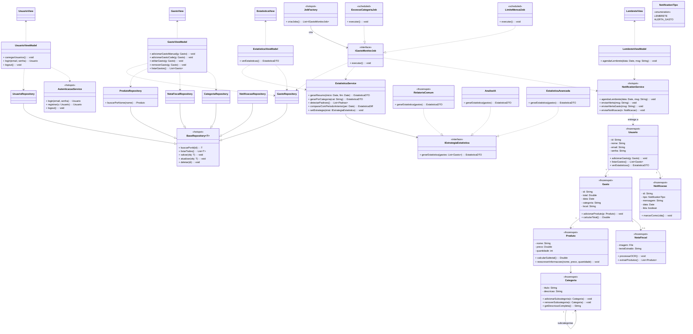

```mermaid
classDiagram
    direction TB

%% ===================== UI =====================
class UsuarioView
class GastoView
class EstatisticaView
class LembreteView

class UsuarioViewModel {
    + carregarUsuarios(): void
    + login(email, senha): Usuario
    + logout(): void
}
class GastoViewModel {
    + adicionarGastoManual(g: Gasto): void
    + adicionarGastoCode(g: Gasto): void
    + editarGasto(g: Gasto): void
    + removerGasto(g: Gasto): void
    + listarGastos(): List~Gasto~
}
class EstatisticaViewModel {
    + verEstatisticas(): EstatisticaDTO
}
class LembreteViewModel {
    + agendarLembrete(data: Date, msg: String): void
}

UsuarioView     <.. UsuarioViewModel
GastoView       <.. GastoViewModel
EstatisticaView <.. EstatisticaViewModel
LembreteView    <.. LembreteViewModel


%% ================== REPOSITORIES ==================
class BaseRepository~T~ {
    <<hotspot>>
    + buscarPorId(id): T
    + listarTodos(): List~T~
    + salvar(obj: T): void
    + atualizar(obj: T): void
    + deletar(id): void
}

class UsuarioRepository {
    
}
class GastoRepository {
    
}
class ProdutoRepository {
    + buscarPorNome(nome): Produto
}
class NotaFiscalRepository {
    
}
class CategoriaRepository {
    
}
class NotificacaoRepository {
    
}

UsuarioRepository    --|> BaseRepository~Usuario~
GastoRepository      --|> BaseRepository~Gasto~
ProdutoRepository    --|> BaseRepository~Produto~
NotaFiscalRepository --|> BaseRepository~NotaFiscal~
CategoriaRepository  --|> BaseRepository~Categoria~
NotificacaoRepository--|> BaseRepository~Notificacao~


%% =================== SERVICES ====================
class AutenticacaoService {
    <<hotspot>>
    + login(email, senha): Usuario
    + registrar(u: Usuario): Usuario
    + logout(): void
}

class NotificationService {
    <<hotspot>>
    + agendarLembrete(data: Date, msg: String): void
    + enviarAlerta(msg: String): void
    + enviarAlertaGasto(msg: String): void
    + enviarNotificacao(n: Notificacao): void
}

class IEstrategiaEstatistica {
    <<interface>>
    <<frozenspot>>
    + gerarEstatistica(gastos: List~Gasto~): EstatisticaDTO
}
class RelatorioComum {
    <<frozenspot>>
    + gerarEstatistica(gastos): EstatisticaDTO
}
class AnaliseIA {
    + gerarEstatistica(gastos): EstatisticaDTO
}
class EstatisticaAvancada {
    + gerarEstatistica(gastos): EstatisticaDTO
}
class EstatisticaService {
    + gerarResumo(inicio: Date, fim: Date): EstatisticaDTO
    + gerarPorCategoria(cat: String): EstatisticaDTO
    + detectarPadroes(): List~Padrao~
    + compararComPeriodoAnterior(per: Date): EstatisticaDiff
    + setEstrategia(strat: IEstrategiaEstatistica): void
}

RelatorioComum      ..|> IEstrategiaEstatistica
AnaliseIA           ..|> IEstrategiaEstatistica
EstatisticaAvancada ..|> IEstrategiaEstatistica
EstatisticaService  --> IEstrategiaEstatistica


%% ============== JOB FACTORY & JOBS ==============
class IGastoMonitorJob {
    <<interface>>
    + executar(): void
}

class JobFactory {
    <<hotspot>>
    + criarJobs(): List~IGastoMonitorJob~
}

class ExcessoCategoriaJob {
    <<scheduled>>
    + executar(): void
}
class LimiteMensalJob {
    <<scheduled>>
    + executar(): void
}

JobFactory --> IGastoMonitorJob : cria
ExcessoCategoriaJob ..|> IGastoMonitorJob
LimiteMensalJob     ..|> IGastoMonitorJob

IGastoMonitorJob ..> GastoRepository
IGastoMonitorJob ..> EstatisticaService
IGastoMonitorJob ..> NotificationService


%% ============= VM DEPENDENCIES ==============
UsuarioViewModel ..> UsuarioRepository
UsuarioViewModel ..> AutenticacaoService

GastoViewModel   ..> GastoRepository
GastoViewModel   ..> ProdutoRepository
GastoViewModel   ..> NotaFiscalRepository
GastoViewModel   ..> CategoriaRepository

EstatisticaViewModel ..> EstatisticaService
EstatisticaViewModel ..> GastoRepository

LembreteViewModel ..> NotificationService
NotificationService ..> Usuario : entrega a


%% ================= ENTIDADES =================
class Usuario {
    <<frozenspot>>
    - id: String
    - nome: String
    - email: String
    - senha: String
    + adicionarGasto(g: Gasto): void
    + listarGastos(): List~Gasto~
    + verEstatisticas(): EstatisticaDTO
}
class Gasto {
    <<frozenspot>>
    - id: String
    - total: Double
    - data: Date
    - categoria: String
    - local: String
    + adicionarProduto(p: Produto): void
    + calcularTotal(): Double
}
class Produto {
    <<frozenspot>>
    - nome: String
    - preco: Double
    - quantidade: int
    + calcularSubtotal(): Double
    + reescreverInformacoes(nome, preco, quantidade): void
}
class NotaFiscal {
    <<frozenspot>>
    - imagem: File
    - textoExtraido: String
    + processarOCR(): void
    + extrairProdutos(): List~Produto~
}
class Categoria {
    <<frozenspot>>
    - titulo: String
    - descricao: String
    + adicionarSubcategoria(c: Categoria): void
    + removerSubcategoria(c: Categoria): void
    + getDescricaoCompleta(): String
}
class Notificacao {
    <<frozenspot>>
    - id: String
    - tipo: NotificationTipo
    - mensagem: String
    - data: Date
    - lida: boolean
    + marcarComoLida(): void
}

class NotificationTipo {
    «enumeration»
    LEMBRETE
    ALERTA_GASTO
}

Usuario "1" --> "*"  Gasto
Gasto   "1" --> "*"  Produto
Gasto   "1" --> "0..1" NotaFiscal
Produto      -->      Categoria
Categoria "1" --> "*" Categoria : subcategorias
Usuario "1" --> "*" Notificacao
```