```mermaid
classDiagram
    direction TB

%% ===================== UI =====================
class MyApp
class MainView
class DashboardView
class AdicionarGastoView
class ExtratoView
class CategoriaView
class MetaView
class GeminiTextView
class GastoView
class UsuarioView

class DashboardViewModel
class GastoViewModel
class CategoriaViewModel
class MetaViewModel
class ExtratoViewModel
class UsuarioViewModel
class ChangeNotifier

MainView <.. DashboardViewModel
DashboardView <.. DashboardViewModel
AdicionarGastoView <.. GastoViewModel
GeminiTextView <.. GastoViewModel
GastoView <.. GastoViewModel
ExtratoView <.. ExtratoViewModel
CategoriaView <.. CategoriaViewModel
MetaView <.. MetaViewModel
UsuarioView <.. UsuarioViewModel
MyApp --> MainView
DashboardViewModel --|> ChangeNotifier
GastoViewModel --|> ChangeNotifier
CategoriaViewModel --|> ChangeNotifier
MetaViewModel --|> ChangeNotifier
ExtratoViewModel --|> ChangeNotifier
UsuarioViewModel --|> ChangeNotifier

%% ================== REPOSITORIES ==================
class BaseRepository~T~
class UsuarioRepository
class GastoRepository
class ProdutoRepository
class NotaFiscalRepository
class CategoriaRepository
class MetaRepository
class NotificacaoRepository

UsuarioRepository --|> BaseRepository~Usuario~
GastoRepository --|> BaseRepository~Gasto~
ProdutoRepository --|> BaseRepository~Produto~
NotaFiscalRepository --|> BaseRepository~NotaFiscal~
CategoriaRepository --|> BaseRepository~Categoria~
MetaRepository --|> BaseRepository~Meta~
NotificacaoRepository --|> BaseRepository~Notificacao~

%% =================== SERVICES ====================
class AuthenticationService
class DashboardService
class NotificacaoService
class GeminiService
class WebScrapingService

class IEstrategiaDashboard
<<interface>> IEstrategiaDashboard
class RelatorioComum
class RelatorioAvancado
class GastoInputStrategy
<<interface>> GastoInputStrategy
class TextInputStrategy
class QrCodeInputStrategy

RelatorioComum ..|> IEstrategiaDashboard
RelatorioAvancado ..|> IEstrategiaDashboard
DashboardService --> IEstrategiaDashboard
TextInputStrategy ..|> GastoInputStrategy
QrCodeInputStrategy ..|> GastoInputStrategy

%% ============= VIEW MODEL DEPENDENCIES =============
DashboardViewModel ..> GastoRepository
DashboardViewModel ..> DashboardService
DashboardViewModel ..> NotificacaoService
GastoViewModel ..> WebScrapingService
GastoViewModel ..> GeminiService
GastoViewModel ..> GastoRepository
GastoViewModel ..> CategoriaRepository
ExtratoViewModel ..> GastoRepository
CategoriaViewModel ..> CategoriaRepository
MetaViewModel ..> MetaRepository
UsuarioViewModel ..> UsuarioRepository
UsuarioViewModel ..> AuthenticationService
NotificacaoService ..> GastoRepository
NotificacaoService ..> MetaRepository
NotificacaoService ..> NotificacaoRepository
NotificacaoService ..> DashboardService
NotificacaoService ..> GeminiService

%% ================= ENTIDADES =================
class Usuario
class Gasto
class Produto
class NotaFiscal
class Categoria
class Meta
class Notificacao
class NotificationTipo
<<enumeration>> NotificationTipo
class DashboardDTO

Usuario "1" --> "*" Gasto
Gasto "1" --> "*" Produto
Gasto "1" --> "0..1" NotaFiscal
Categoria "1" --> "*" Categoria : subcategorias
Usuario "1" --> "*" Notificacao
```

## Padrões de Projeto
- **Repository**: `BaseRepository` e subclasses isolam a persistência.
- **Strategy**: `IEstrategiaDashboard`, `GastoInputStrategy` e suas implementações.
- **Composite**: `CategoriaComponent` e `Categoria` para hierarquias de categorias.
- **MVVM**: Views consomem `ViewModel` com `ChangeNotifier`.
- **Observer**: mudanças nos modelos disparam `notifyListeners` via `ChangeNotifier`.
```
