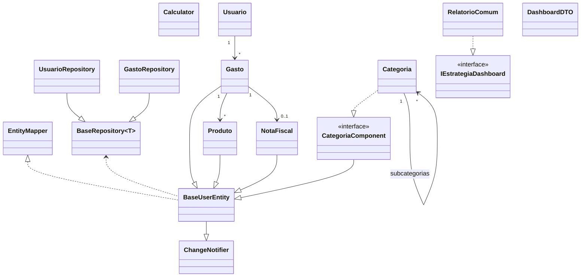

```mermaid
classDiagram
    direction TB

%% ================= BASE =================
class EntityMapper
class BaseUserEntity
class BaseRepository~T~
class ChangeNotifier
class Calculator

BaseUserEntity --|> ChangeNotifier

EntityMapper <|.. BaseUserEntity
BaseRepository~T~ <.. BaseUserEntity

%% ================= REPOSITORIES =================
class UsuarioRepository
class GastoRepository
UsuarioRepository --|> BaseRepository~Usuario~
GastoRepository --|> BaseRepository~Gasto~

%% ================= MODELS =================
class Usuario
class Gasto
class Produto
class NotaFiscal
class CategoriaComponent <<interface>>
class Categoria

Gasto --|> BaseUserEntity
Produto --|> BaseUserEntity
NotaFiscal --|> BaseUserEntity
CategoriaComponent --|> BaseUserEntity

Categoria ..|> CategoriaComponent
Usuario "1" --> "*" Gasto
Gasto "1" --> "*" Produto
Gasto "1" --> "0..1" NotaFiscal
Categoria "1" --> "*" Categoria : subcategorias

%% ================= DASHBOARD =================
class IEstrategiaDashboard <<interface>>
class RelatorioComum
class DashboardDTO

RelatorioComum ..|> IEstrategiaDashboard
```

